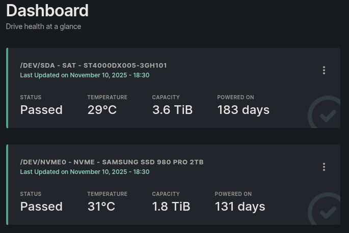

# Scrutiny - (S.M.A.R.T. visualizer)
docker compose for running **[scrutiny](https://github.com/AnalogJ/scrutiny)**




## overview
scrutiny collects and displays health information from all drives connected to the host.  
I’m using the **omnibus image** (includes InfluxDB) so it’s just one container.

## reason
**[smartmontools](www.smartmontools.org)** is spectacular software
however, taking the time to wade through 
```bash
sudo smartctl -a /dev/<whatever-drive>
```
and actually coming up with a good idea how all of your drives are doing, and more importantly how worried you should be, requires a lot of time

I used to use **[Hard Drive Sentinel](https://www.hdsentinel.com/hard_disk_sentinel_linux.php)** for this purpose, however it hasn't been an active project in years

scrutiny works really well and and I think actually uses backblaze statistics to give you a break down of what the statistical likelihook of one of your drives failing is based on the value of a given attribute, interesting stuff

the problem is `smartctl` requires root priviledges, and therefore creating and using a container without `privileged: true` is sort of a pain

"but austin you did `cap_add: - SYS_ADMIN` and `- SYS_RAWIO`", which is true, and while that is less than ideal from a security perspective, it is **WAY BETTER** than `privileged: true`. additionally, it is **ALSO WAY BETTER** than having a drive that is screaming at you that it's going to die and not knowing because you don't have time to wade into the minutae of the S.M.A.R.T. data (though if you think S.M.A.R.T. will save you from drive failure/data loss, nope)

when you're doing a thing, and it requires effort, a repo is a good idea
- it will likely save you time in the future
- and someone else might benefit as well

## usage
Clone the repo and run:
```bash
docker compose up -d
```

Then open http://localhost:8088 (or whatever host port you mapped)

## configuration
- container runs as root to access /dev/nvme* and /dev/sd*.
- added minimal capabilities (SYS_ADMIN, SYS_RAWIO) so it can read data without being fully privileged.
- data is stored locally in:
-- ./config → scrutiny config
-- ./influxdb → time-series data

## notes
change the host port in the compose file if 8088 is in use.

drives must be visible on the host (smartctl should work locally).

tested on Debian 13 with Docker Compose v2.

this is for personal use / homelab monitoring — no external network exposure.

---

&nbsp;

**466f724a616e6574**